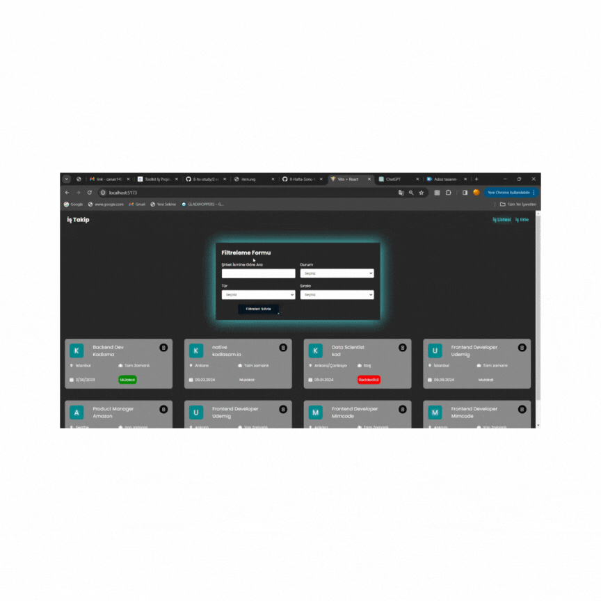

# toolkit_JobApp

## home page
💻 The project is an application created using Redux and Redux Toolkit technologies, allowing users to create task lists based on different categories. 

 📇 The application features adding tasks, auto-completion when adding tasks, and deleting added tasks. 

📊Additionally, the application allows filtering tasks based on city, company name, status, type, and entry date to the company, enabling users to personalize their task lists and create their own lists. 

🗓 Furthermore, the project includes advanced task management features such as prioritizing tasks, calendar integration, and defining task stages (e.g., "interview," "in progress," "rejected").

## toolkit_JobApp

## 📚 Libraries:
📌 react-router-dom

📌 axios

📌 sass

📌 react-toastify

📌 json-server

📌 react-redux

📌 @reduxjs/toolkit

📌 uuid

📌 react-icons

